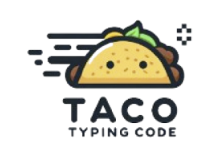

---

# Taco (Typing code practice)

## Try It Out

Experience the Typing Speed Test in action: [**Click Here to Test Your Typing Speed**](https://taco---typing-code.web.app/)

---

## 🚀 Overview

Typing Speed Test is a sleek and interactive web application designed to measure and enhance your typing skills. Built with the power of React and Firebase, it offers a seamless user experience across various devices.

## 🛠 Installation

1. **Clone the Repository**
   ```bash
   git clone https://github.com/zhoho/typing-speed.git
   ```
2. **Navigate to the Project Directory**
   ```bash
   cd typing-speed
   ```
3. **Install Dependencies**
   ```bash
   npm install
   ```

## 🚀 Getting Started

- **Start the Development Server**
  ```bash
  npm start
  ```
- **Open in Browser**
  Visit [http://localhost:3000](http://localhost:3000) to see the application in action.

## 📜 Available Scripts

- **`npm start`**: Launch the app in development mode.
- **`npm test`**: Run tests to ensure code quality.
- **`npm run build`**: Compile the app for production.
- **`npm run eject`**: Customize the Create React App configuration.

## Demo


## 🤝 Contributing

We welcome contributions! Fork the repo, create a feature branch, and submit a pull request. Let's build something amazing together!

## 📄 License

This project is licensed under the MIT License. See the [LICENSE](LICENSE) file for details.

---

Elevate your typing game with the Typing Speed Test app! 🚀

---
